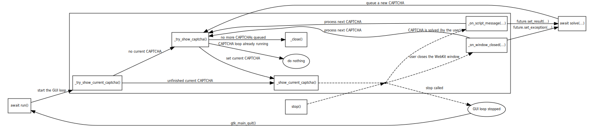

# decaptcha

This module lets you solve [reCAPTCHAs](https://developers.google.com/recaptcha/intro)
(or other CAPTCHAs) outside the browser.

Specially crafted pages displaying CAPTCHA and retrieving it's response are
displayed in WebKit.

## Usage

Look at [test/test_recaptcha.py](test/test_recaptcha.py) for example usage.
Python 3.5 or higher is required, because the module is typed.

## About

Because reCAPTCHA verifies the host it is running on, reCAPTCHAs from a site
cannot simply be embedded somewehere else with code extracting the reCAPTCHA
challenge response around them. The page extracting the reCAPTCHA challenge
response must be served on the original host. [[1]](https://developers.google.com/recaptcha/docs/domain_validation "Domain/Package Name Validation")

By displaying the CAPTCHA in a WebKitGTK web view we can fake the location
with the `base_uri` argument of [`webkit_web_view_load_html`](https://webkitgtk.org/reference/webkit2gtk/stable/WebKitWebView.html#webkit-web-view-load-html).
The path taken by the Electron version of running a HTTPS server and a SOCKS5
proxy is therefore not necessary.

### Inner workings

To use python's async and the glib event loop together, [gtk_main](https://developer.gnome.org/gtk3/stable/gtk3-General.html#gtk-main)
is called in another thread than the python's native event loop. Because of this
special care needs to be taken when calling glib/GTK functions. Only
`DeCaptcha`'s `run`, `solve`, `stop`, or `cancel_current` are safe to call.

The CAPTCHA requests are processed in the following loop:

